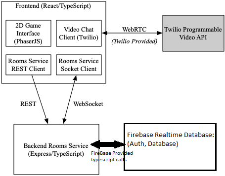

# DESIGN

The feature we proposed to implement was to give users the option to create a Covey.Town account, and to have a database that stores all newly created accounts and their respective information. The figure above depicts the new high-level architecture of Covey.Town after implementing our proposed feature.

Many new frontend components were created. These include (frontend/src/components/Login/CreateAccount.tsx) to allow users to create an account; (frontend/src/components/Login/LoginScreen.tsx) to allow users to either log in to their account or continue as a guest; (frontend/src/components/Login/EditAccount.tsx) to allow users to edit their account; and (frontend/src/components/Login/UserProfile.tsx) to allow users to either create an account if they are signed in as a guest, or otherwise manage a friends list.

The backend implements Firebase Realtime Database as our database, and we use that to handle user authentication as well.

# CRC cards

Name: CreateAccount (functional component)
State: the user's username, display name, email, password, password confirmation
Responsibilities: creates the UI that allows users to create a new account
Collaborators: LoginScreen, UserProfile

Name: LoginScreen (functional component)
State: the user's login email, password
Responsibilities: creates the UI that allows users to log in or continue as a guest
Collaborators: App

Name: EditAccount (functional component)
State: the user's current password, new password, new password confirmation
Responsibilities: creates the UI that allows users to edit their account
Collaborators: UserProfile

Name: UserProfile (functional component)
State: the user's display name, friends (online and offline), friend requests (sent and received)
Responsibilities: creates the UI that allows users to manage their profile and friends list
Collaborators: MainParticipantInfo, Participant, ParticipantInfo, PreJoinScreens, UserProfileContext, useUserProfile
